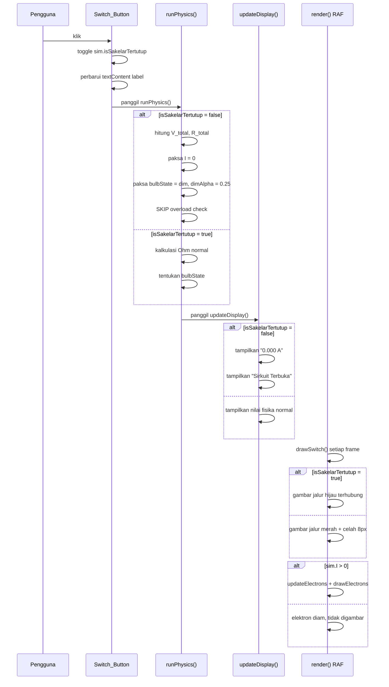
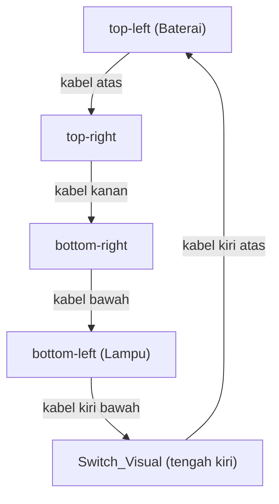

# Design Document: Sakelar On/Off

## Overview

Fitur Sakelar On/Off menambahkan komponen sakelar interaktif ke Simulator Sirkuit Digital.
Pengguna dapat memutus dan menyambung arus secara manual melalui Switch_Button di Control_Panel,
sementara Switch_Visual digambar di canvas sebagai bagian jalur kabel sirkuit.
Seluruh implementasi terbatas pada tiga file inti yang sudah ada tanpa dependensi eksternal.

---

## Architecture

Fitur ini tidak menambah lapisan arsitektur baru. Semua perubahan bersifat additive di dalam
tiga modul yang sudah ada di `sirkuit.js` (IIFE):

```
sirkuit.js (IIFE) — perubahan per modul
│
├── sim (State Object)
│   └── + isSakelarTertutup : true   ← satu-satunya properti baru
│
├── Physics Engine
│   └── runPhysics()                 ← tambah blok sakelar OFF di awal kalkulasi
│
├── Canvas Renderer
│   ├── drawWires()                  ← delegasi ke drawSwitch() untuk Switch_Visual
│   └── + drawSwitch(geo)            ← fungsi baru: gambar sakelar di sisi kiri
│
├── UI / Display
│   └── updateDisplay()              ← tambah cabang isSakelarTertutup=false
│
└── Event Handlers
    ├── + onSakelarToggle()           ← handler baru untuk Switch_Button
    └── onReset()                    ← tambah reset isSakelarTertutup = true
```

### Alur Data dengan Sakelar

```
User klik Switch_Button (#btnSakelar)
        |
        v
onSakelarToggle()
  sim.isSakelarTertutup = !sim.isSakelarTertutup
  btnSakelar.textContent = label baru
        |
        v
runPhysics()
  IF isSakelarTertutup = false:
    hitung V_total, R_total (tetap dihitung)
    paksa I = 0
    paksa bulbState = 'dim', dimAlpha = 0.25
    RETURN (skip overload check)
  ELSE:
    kalkulasi normal (alur existing)
        |
        v
updateDisplay()
  IF isSakelarTertutup = false:
    tampilkan I = "0.000 A"
    tampilkan status = "Sirkuit Terbuka"
  ELSE:
    tampilkan nilai normal
        |
        v
RAF loop (render setiap frame)
  drawWires() -> drawSwitch()
    IF isSakelarTertutup: warna hijau, jalur terhubung
    ELSE: warna merah, celah 8px
  IF sim.I > 0: updateElectrons + drawElectrons
  ELSE: elektron tidak bergerak, tidak digambar
```

---

## Main Algorithm/Workflow



---

## Components and Interfaces

### 1. Perubahan State Object (`sim`)

Tambahkan satu properti baru pada deklarasi awal `sim`. Shape tetap monomorphic — tidak ada
properti yang ditambah di runtime.

```javascript
const sim = {
  circuitType        : 'seri',
  batteryCount       : 1,
  bulbCount          : 1,
  bulbWatt           : 10,
  V_total            : 0,
  R_total            : 0,
  I                  : 0,
  I_peak             : 0,
  P_actual           : 0,
  bulbState          : 'normal',
  dimAlpha           : 1.0,
  wasOverload        : false,
  blastTime          : 0,
  blastActive        : false,
  isSakelarTertutup  : true,
};
```

**Aturan:**
- `isSakelarTertutup` adalah satu-satunya properti baru yang ditambahkan ke `sim`
- Tipe: `boolean`, default `true` (sakelar tertutup = ON saat halaman dimuat)
- Hanya `runPhysics()` yang boleh membaca dan `onSakelarToggle()` yang boleh menulis nilai ini
- `onReset()` wajib mengatur kembali ke `true`


### 2. Modifikasi `runPhysics()`

Tambahkan blok sakelar OFF di awal fungsi, setelah kalkulasi `V_total` dan `R_total` selesai
namun sebelum kalkulasi `I` dan pengecekan overload.

```pascal
PROCEDURE runPhysics()
  INPUT: sim.* (dibaca), sim.* (ditulis)
  OUTPUT: void

  SEQUENCE
    R_bulb <- (V_BATTERY * V_BATTERY) / sim.bulbWatt

    IF sim.circuitType = 'seri' THEN
      V_total    <- sim.batteryCount * V_BATTERY
      R_total    <- sim.bulbCount * R_bulb
      V_per_bulb <- V_total / sim.bulbCount
    ELSE
      V_total    <- V_BATTERY
      R_total    <- R_bulb / sim.bulbCount
      V_per_bulb <- V_BATTERY
    END IF

    IF sim.isSakelarTertutup = false THEN
      sim.V_total  <- V_total
      sim.R_total  <- R_total
      sim.I        <- 0
      sim.P_actual <- 0
      sim.bulbState <- 'dim'
      sim.dimAlpha  <- 0.25
      RETURN
    END IF

    I        <- R_total > 0 ? V_total / R_total : 0
    P_actual <- R_bulb > 0 ? (V_per_bulb * V_per_bulb) / R_bulb : 0

    [... kalkulasi bulbState dan overload existing tidak berubah ...]

    sim.V_total   <- V_total
    sim.R_total   <- R_total
    sim.I         <- I
    sim.P_actual  <- P_actual
    sim.bulbState <- bulbState
    sim.dimAlpha  <- dimAlpha
    sim.wasOverload <- nowOverload
  END SEQUENCE
END PROCEDURE
```

**Preconditions:**
- `sim.isSakelarTertutup` bertipe boolean dan sudah ada di `sim` sejak deklarasi
- `sim.bulbWatt` adalah salah satu dari `{5, 10, 25}`

**Postconditions (sakelar OFF):**
- `sim.I = 0` untuk semua kombinasi input
- `sim.bulbState = 'dim'`, `sim.dimAlpha = 0.25`
- `sim.V_total` dan `sim.R_total` tetap dihitung sesuai konfigurasi aktif
- `sim.blastActive` tidak berubah (tidak dipicu)
- `sim.wasOverload` tidak berubah

**Postconditions (sakelar ON):**
- Identik dengan perilaku `runPhysics()` sebelum fitur ini ditambahkan


### 3. Fungsi Baru `drawSwitch(geo)`

Fungsi baru yang dipanggil dari dalam `drawWires()`. Menggambar Switch_Visual di sisi kiri
jalur kabel, antara titik `top-left` dan `bottom-left` pada `wirePath`.

```pascal
PROCEDURE drawSwitch(geo)
  INPUT: geo (GeometryResult dari getGeometry())
  OUTPUT: void (menggambar ke ctx)

  SEQUENCE
    switchX  <- geo.left
    switchMidY <- (geo.top + geo.bottom) / 2
    halfLen  <- min(cw, ch) * 0.06

    pointA <- { x: switchX, y: switchMidY - halfLen }
    pointB <- { x: switchX, y: switchMidY + halfLen }

    IF sim.isSakelarTertutup = true THEN
      ctx.strokeStyle <- '#00AA00'
      ctx.lineWidth   <- 6
      ctx.beginPath()
      ctx.moveTo(pointA.x, pointA.y)
      ctx.lineTo(pointB.x, pointB.y)
      ctx.stroke()
    ELSE
      ctx.strokeStyle <- '#CC0000'
      ctx.lineWidth   <- 6
      ctx.beginPath()
      ctx.moveTo(pointA.x, pointA.y)
      ctx.lineTo(pointA.x, pointA.y + halfLen - 4)
      ctx.stroke()
      ctx.beginPath()
      ctx.moveTo(pointB.x, pointB.y - halfLen + 4)
      ctx.lineTo(pointB.x, pointB.y)
      ctx.stroke()
    END IF

    ctx.fillStyle    <- '#90b4ce'
    ctx.font         <- '11px sans-serif'
    ctx.textAlign    <- 'right'
    ctx.textBaseline <- 'middle'
    labelText <- sim.isSakelarTertutup ? 'ON' : 'OFF'
    ctx.fillText(labelText, switchX - 8, switchMidY)
  END SEQUENCE
END PROCEDURE
```

**Preconditions:**
- `geo` adalah hasil valid dari `getGeometry()`
- `ctx` adalah `CanvasRenderingContext2D` yang valid
- `sim.isSakelarTertutup` bertipe boolean

**Postconditions:**
- Switch_Visual digambar di posisi yang konsisten setiap frame
- Warna hijau `#00AA00` saat ON, merah `#CC0000` saat OFF
- Celah minimal 8px pada jalur kabel saat OFF
- Posisi dan ukuran proporsional terhadap dimensi canvas (responsif)


### 4. Modifikasi `drawWires(geo)`

Tambahkan satu pemanggilan `drawSwitch(geo)` di akhir fungsi `drawWires()`, setelah
semua kabel dasar dan glow overlay selesai digambar.

```pascal
PROCEDURE drawWires(geo)
  INPUT: geo
  OUTPUT: void

  SEQUENCE
    [... kode existing: gambar kabel dasar + glow overlay ...]

    drawSwitch(geo)
  END SEQUENCE
END PROCEDURE
```

**Alasan penempatan di `drawWires()`:** Switch_Visual adalah bagian dari jalur kabel,
bukan komponen terpisah. Menempatkannya di sini menjaga urutan layer rendering yang benar
(kabel → sakelar → baterai → lampu → label → elektron).


### 5. Modifikasi `updateDisplay()`

Tambahkan cabang `isSakelarTertutup = false` di awal fungsi, sebelum logika tampilan
yang sudah ada. Fungsi ini tetap read-only terhadap `sim.*`.

```pascal
PROCEDURE updateDisplay()
  INPUT: sim.* (read-only)
  OUTPUT: void (menulis ke DOM)

  SEQUENCE
    elVoltage.textContent    <- sim.V_total.toFixed(2) + ' V'
    elResistance.textContent <- sim.R_total.toFixed(2) + ' Ohm'
    elPower.textContent      <- sim.P_actual.toFixed(2) + ' W'

    IF sim.isSakelarTertutup = false THEN
      elLabelCurrent.textContent  <- 'Arus (I)'
      elCurrent.textContent       <- '0.000 A'
      elItemCurrentPerBulb.hidden <- true
      elItemCurrentPeak.hidden    <- true
      elStatus.className          <- 'info-value info-value--status status-open'
      elStatus.textContent        <- 'Sirkuit Terbuka'
      elBatteryLife.textContent   <- '-'
      RETURN
    END IF

    [... logika updateDisplay() existing tidak berubah ...]
  END SEQUENCE
END PROCEDURE
```

**Preconditions:**
- `sim.isSakelarTertutup` bertipe boolean
- Semua elemen DOM sudah di-cache saat `init()`

**Postconditions (sakelar OFF):**
- `elCurrent.textContent` selalu `'0.000 A'`
- `elStatus.textContent` selalu `'Sirkuit Terbuka'` (via `textContent`, bukan `innerHTML`)
- `elItemCurrentPerBulb.hidden = true`
- `elItemCurrentPeak.hidden = true`
- `elBatteryLife.textContent = '-'`
- V_total dan R_total tetap ditampilkan sesuai konfigurasi aktif


### 6. Fungsi Baru `onSakelarToggle()`

Event handler untuk Switch_Button (`#btnSakelar`). Mengikuti pola yang sama dengan
semua handler lain: update `sim.*` → `runPhysics()` → `updateDisplay()`.

```pascal
PROCEDURE onSakelarToggle()
  INPUT: void
  OUTPUT: void

  SEQUENCE
    sim.isSakelarTertutup <- NOT sim.isSakelarTertutup

    IF sim.isSakelarTertutup = true THEN
      btnSakelar.textContent <- 'ON (Tertutup)'
    ELSE
      btnSakelar.textContent <- 'OFF (Terbuka)'
    END IF

    runPhysics()
    updateDisplay()
  END SEQUENCE
END PROCEDURE
```

**Preconditions:**
- `sim.isSakelarTertutup` bertipe boolean
- `btnSakelar` adalah referensi DOM yang valid ke `#btnSakelar`

**Postconditions:**
- `sim.isSakelarTertutup` bernilai kebalikan dari nilai sebelumnya
- Label tombol diperbarui sesuai posisi baru
- `runPhysics()` dan `updateDisplay()` dipanggil dalam urutan yang benar
- Canvas diperbarui otomatis oleh RAF loop pada frame berikutnya


### 7. Modifikasi `onReset()`

Tambahkan satu baris reset `sim.isSakelarTertutup = true` dan pembaruan label tombol.

```pascal
PROCEDURE onReset()
  SEQUENCE
    [... reset existing: circuitType, batteryCount, bulbCount, bulbWatt, wasOverload, dll ...]

    sim.isSakelarTertutup    <- true
    btnSakelar.textContent   <- 'ON (Tertutup)'

    [... reset DOM controls existing ...]

    runPhysics()
    updateDisplay()
  END SEQUENCE
END PROCEDURE
```

**Postconditions:**
- `sim.isSakelarTertutup = true` setelah reset
- Label `#btnSakelar` kembali ke `'ON (Tertutup)'`
- Semua properti `sim.*` lain dikembalikan ke nilai default


---

## Data Models

### SimState — Setelah Penambahan `isSakelarTertutup`

```typescript
interface SimState {
  circuitType       : 'seri' | 'paralel';
  batteryCount      : 1 | 2 | 3 | 4;
  bulbCount         : 1 | 2 | 3 | 4;
  bulbWatt          : 5 | 10 | 25;
  V_total           : number;
  R_total           : number;
  I                 : number;
  I_peak            : number;
  P_actual          : number;
  bulbState         : 'dim' | 'normal' | 'overload';
  dimAlpha          : number;
  wasOverload       : boolean;
  blastTime         : number;
  blastActive       : boolean;
  isSakelarTertutup : boolean;
}
```

Total properti: 15 (sebelumnya 14). `assertSimMonomorphic()` harus diperbarui untuk
memverifikasi 15 properti dengan tipe yang benar.

**Nilai default setelah reset:**

| Field | Default |
|---|---|
| `isSakelarTertutup` | `true` |
| Semua field lain | Tidak berubah dari sebelumnya |


### DOM Element References — Tambahan

| Variabel | Selector | Tipe |
|---|---|---|
| `btnSakelar` | `#btnSakelar` | `HTMLButtonElement` |

Di-cache saat `init()` bersama referensi DOM lainnya, tidak pernah di-query ulang.

---

## HTML: Switch_Button di Control_Panel

Tambahkan elemen `<button>` baru di dalam `<section class="control-panel">`, setelah
fieldset Daya Nominal Lampu dan sebelum `#btnReset`.

```html
<div class="control-group">
  <button
    class="btn-sakelar btn-sakelar--on"
    id="btnSakelar"
    type="button"
    aria-label="Toggle sakelar: saat ini ON (tertutup), tekan untuk membuka sirkuit"
    aria-pressed="true"
  >
    ON (Tertutup)
  </button>
</div>
```

**Aturan:**
- `id="btnSakelar"` untuk referensi DOM di `sirkuit.js`
- `aria-pressed` diperbarui oleh `onSakelarToggle()` sesuai posisi sakelar
- Label teks menggunakan `textContent` (bukan `innerHTML`), tanpa emoji
- Ditempatkan di dalam `.control-group` agar konsisten dengan layout panel


---

## CSS: Styling Switch_Button

Tambahkan dua class baru di `style.css`. Mengikuti pola visual yang sudah ada di proyek
(dark navy background, border berwarna, min-height 44px untuk touch target).

```css
.btn-sakelar {
  display: flex;
  align-items: center;
  justify-content: center;
  width: 100%;
  min-height: 48px;
  padding: var(--sp-sm) var(--sp-md);
  font-size: var(--fs-sm);
  font-weight: 700;
  font-family: var(--font-base);
  border-radius: var(--radius-md);
  cursor: pointer;
  transition: background 0.2s ease, box-shadow 0.2s ease, transform 0.1s ease;
  letter-spacing: 0.03em;
  border: 2px solid transparent;
}

.btn-sakelar--on {
  background: linear-gradient(135deg, #0d2a1a, #1a4a2e);
  color: #69f0ae;
  border-color: #00AA00;
}

.btn-sakelar--on:hover {
  background: linear-gradient(135deg, #122e1e, #1e5234);
  box-shadow: 0 0 16px rgba(0, 170, 0, 0.4);
}

.btn-sakelar--off {
  background: linear-gradient(135deg, #2a0d0d, #4a1a1a);
  color: #ff8a80;
  border-color: #CC0000;
}

.btn-sakelar--off:hover {
  background: linear-gradient(135deg, #2e1212, #521e1e);
  box-shadow: 0 0 16px rgba(204, 0, 0, 0.4);
}

.btn-sakelar:active {
  transform: scale(0.97);
}

.btn-sakelar:focus-visible {
  outline: 3px solid var(--clr-accent);
  outline-offset: 3px;
}
```

**Aturan class switching:** `onSakelarToggle()` mengganti class `.btn-sakelar--on` /
`.btn-sakelar--off` pada elemen `#btnSakelar` sesuai posisi sakelar.


---

## Posisi Switch_Visual di Canvas

Switch_Visual ditempatkan di **sisi kiri jalur kabel**, di tengah antara titik `top-left`
dan `bottom-left` pada `wirePath`.

```
wirePath:
  [0] top-left    (left, top)
  [1] top-right   (right, top)     <- baterai di sini
  [2] bottom-right (right, bottom)
  [3] bottom-left  (left, bottom)  <- lampu di sini
  [4] top-left    (left, top)

Switch_Visual:
  x = left
  y = (top + bottom) / 2           <- tengah sisi kiri
  panjang segmen = min(cw, ch) * 0.12
```

Posisi ini dipilih karena:
- Sisi kiri adalah segmen kabel yang tidak memiliki komponen lain (baterai di atas, lampu di bawah)
- Secara visual konsisten dengan diagram sirkuit standar (sakelar di jalur utama)
- Proporsional terhadap ukuran canvas sehingga responsif saat resize




---

## Modifikasi `runSelfTests()` — assertSimMonomorphic dan Property Tests

### 8a. Perbarui `assertSimMonomorphic()`

Tambahkan `'isSakelarTertutup'` ke `requiredKeys` dan perbarui pengecekan jumlah key
dari 14 menjadi 15. Tambahkan pengecekan tipe boolean.

```pascal
PROCEDURE assertSimMonomorphic()
  requiredKeys <- [
    'circuitType', 'batteryCount', 'bulbCount', 'bulbWatt',
    'V_total', 'R_total', 'I', 'I_peak', 'P_actual',
    'bulbState', 'dimAlpha', 'wasOverload', 'blastTime', 'blastActive',
    'isSakelarTertutup'
  ]

  [... pengecekan keberadaan key dan jumlah key (15) ...]

  IF typeof sim.isSakelarTertutup != 'boolean' THEN
    THROW Error('assertSimMonomorphic: isSakelarTertutup must be boolean')
  END IF
END PROCEDURE
```

### 8b. Perbarui `snapshotSim()` dan `restoreSim()`

Tambahkan `isSakelarTertutup` ke snapshot dan restore agar isolasi state test tetap lengkap.

```pascal
FUNCTION snapshotSim()
  RETURN {
    [... field existing ...]
    isSakelarTertutup : sim.isSakelarTertutup,
  }
END FUNCTION

PROCEDURE restoreSim(snapshot)
  [... restore field existing ...]
  sim.isSakelarTertutup <- snapshot.isSakelarTertutup
  [... updateDisplay() ...]
END PROCEDURE
```


### 8c. Property Test S1 — `assertSakelarForcesZeroCurrent()`

Memverifikasi Property S1: `isSakelarTertutup = false` memaksa `sim.I = 0` untuk semua
kombinasi input.

```pascal
PROCEDURE assertSakelarForcesZeroCurrent()
  INPUT: void
  OUTPUT: void (throw Error jika gagal)

  SEQUENCE
    circuitTypes  <- ['seri', 'paralel']
    batteryCounts <- [1, 2, 3, 4]
    bulbCounts    <- [1, 2, 3, 4]
    wattOptions   <- [5, 10, 25]

    FOR EACH type IN circuitTypes DO
      FOR EACH batteries IN batteryCounts DO
        FOR EACH bulbs IN bulbCounts DO
          FOR EACH watt IN wattOptions DO
            sim.circuitType       <- type
            sim.batteryCount      <- batteries
            sim.bulbCount         <- bulbs
            sim.bulbWatt          <- watt
            sim.isSakelarTertutup <- false
            sim.wasOverload       <- false
            sim.blastActive       <- false

            runPhysics()

            IF sim.I != 0 THEN
              THROW Error('assertSakelarForcesZeroCurrent: I must be 0 when sakelar OFF, got=' + sim.I)
            END IF
          END FOR
        END FOR
      END FOR
    END FOR
  END SEQUENCE
END PROCEDURE
```


### 8d. Property Test S2 — `assertSakelarDimState()`

Memverifikasi Property S2: `isSakelarTertutup = false` menghasilkan `bulbState = 'dim'`
dan `dimAlpha = 0.25` untuk semua kombinasi input.

```pascal
PROCEDURE assertSakelarDimState()
  INPUT: void
  OUTPUT: void (throw Error jika gagal)

  SEQUENCE
    circuitTypes  <- ['seri', 'paralel']
    batteryCounts <- [1, 2, 3, 4]
    bulbCounts    <- [1, 2, 3, 4]
    wattOptions   <- [5, 10, 25]

    FOR EACH type IN circuitTypes DO
      FOR EACH batteries IN batteryCounts DO
        FOR EACH bulbs IN bulbCounts DO
          FOR EACH watt IN wattOptions DO
            sim.circuitType       <- type
            sim.batteryCount      <- batteries
            sim.bulbCount         <- bulbs
            sim.bulbWatt          <- watt
            sim.isSakelarTertutup <- false
            sim.wasOverload       <- false
            sim.blastActive       <- false

            runPhysics()

            IF sim.bulbState != 'dim' THEN
              THROW Error('assertSakelarDimState: bulbState must be dim when sakelar OFF, got=' + sim.bulbState)
            END IF

            IF sim.dimAlpha != 0.25 THEN
              THROW Error('assertSakelarDimState: dimAlpha must be 0.25 when sakelar OFF, got=' + sim.dimAlpha)
            END IF
          END FOR
        END FOR
      END FOR
    END FOR
  END SEQUENCE
END PROCEDURE
```


### 8e. Integrasi ke `runSelfTests()`

Kedua property test dipanggil di dalam blok `try` yang sudah ada, setelah
`assertSimMonomorphic()` dan sebelum loop property test existing.

```pascal
PROCEDURE runSelfTests()
  savedSim <- snapshotSim()

  TRY
    assertSimMonomorphic()
    assertGeometry()
    assertParticleSystemMonomorphic()
    assertBulbStateClassification()
    assertRenderLayerOrder()

    assertSakelarForcesZeroCurrent()
    assertSakelarDimState()

    [... loop property test existing tidak berubah ...]

    assertElectronStillWhenZeroCurrent()
    assertBlastTriggeredOncePerTransition()
    assertCriticalScenarios()
    assertBatteryLifeCalc()
    assertParallelIPerBulb()
    assertSeriesInvariant()

    assertSimMonomorphic()
  FINALLY
    restoreSim(savedSim)
  END TRY
END PROCEDURE
```

**Aturan isolasi:** Kedua fungsi test memanggil `runPhysics()` secara langsung, sehingga
mereka memodifikasi `sim.*`. Isolasi dijamin oleh `snapshotSim()` / `restoreSim()` di
level `runSelfTests()` — tidak perlu snapshot tambahan di dalam masing-masing fungsi test,
karena `restoreSim()` di blok `finally` akan selalu mengembalikan state ke kondisi production.


---

## Correctness Properties

### Property 1: Sakelar OFF Memaksa I = 0

**Validates: Requirements 2.1**
UNTUK SEMUA circuitType IN {'seri', 'paralel'},
UNTUK SEMUA batteryCount IN {1, 2, 3, 4},
UNTUK SEMUA bulbCount IN {1, 2, 3, 4},
UNTUK SEMUA bulbWatt IN {5, 10, 25}:
  JIKA isSakelarTertutup = false
  MAKA sim.I = 0
```

Diverifikasi oleh: `assertSakelarForcesZeroCurrent()`

### Property 2: Sakelar OFF Menghasilkan Dim_State

**Validates: Requirements 2.2**
UNTUK SEMUA kombinasi input yang valid:
  JIKA isSakelarTertutup = false
  MAKA sim.bulbState = 'dim' DAN sim.dimAlpha = 0.25
```

Diverifikasi oleh: `assertSakelarDimState()`

### Property 3: Round-Trip ON -> OFF -> ON Menghasilkan Nilai Identik

**Validates: Requirements 2.3, 2.5**
UNTUK SEMUA kombinasi input yang valid:
  snapshot_sebelum = computePhysicsSnapshot(type, batteries, bulbs, watt)
  SET isSakelarTertutup = false -> runPhysics()
  SET isSakelarTertutup = true  -> runPhysics()
  snapshot_sesudah = {sim.I, sim.V_total, sim.R_total, sim.P_actual, sim.bulbState}

  MAKA snapshot_sesudah.I        = snapshot_sebelum.I
  DAN  snapshot_sesudah.V_total  = snapshot_sebelum.V_total
  DAN  snapshot_sesudah.R_total  = snapshot_sebelum.R_total
  DAN  snapshot_sesudah.P_actual = snapshot_sebelum.P_actual
  DAN  snapshot_sesudah.bulbState = snapshot_sebelum.bulbState
```

Dijamin oleh desain: blok sakelar OFF di `runPhysics()` menggunakan `RETURN` awal,
sehingga kalkulasi normal tidak terpengaruh saat sakelar kembali ON.

### Property 4: Sakelar OFF Tidak Memicu Blast/Overload

**Validates: Requirements 2.4**
UNTUK SEMUA kombinasi input yang menghasilkan Overload_State ketika isSakelarTertutup = true:
  SET sim.wasOverload = false
  SET isSakelarTertutup = false
  runPhysics()
  MAKA sim.blastActive = false (tidak berubah)
  DAN  sim.wasOverload = false (tidak berubah)
```

Dijamin oleh desain: blok sakelar OFF menggunakan `RETURN` sebelum pengecekan overload.

### Property 5: Elektron Tidak Bergerak saat Sakelar OFF

**Validates: Requirements 4.1**
JIKA isSakelarTertutup = false (sehingga sim.I = 0)
MAKA speedFactor = min(0 * 8, 6) = 0
     delta progress = BASE_SPEED * 0 = 0
     p.progress setelah frame = p.progress sebelum frame
```

Dijamin oleh desain: `render()` hanya memanggil `updateElectrons()` dan `drawElectrons()`
ketika `sim.I > 0`. Karena sakelar OFF memaksa `sim.I = 0`, elektron tidak diperbarui
dan tidak digambar.


---

## Error Handling

### E1 — `#btnSakelar` Tidak Ditemukan di DOM

**Kondisi:** `document.getElementById('btnSakelar')` mengembalikan `null` karena elemen
belum ada di HTML atau typo pada ID.

**Penanganan:** Guard di `init()` sebelum event binding:

```pascal
IF btnSakelar = null THEN
  THROW Error('btnSakelar element not found')
END IF
```

Ini konsisten dengan pola yang sudah ada untuk elemen DOM lain di proyek.

### E2 — `drawSwitch()` Dipanggil Sebelum Canvas Siap

**Kondisi:** `ctx` belum diinisialisasi atau `cw`/`ch` bernilai 0.

**Penanganan:** `drawSwitch()` dipanggil dari dalam `drawWires()` yang sudah berada di
dalam `render()`. `render()` hanya dipanggil dari `loop()` yang dimulai setelah `init()`
selesai. Guard `if (!ctx)` di `init()` sudah mencegah loop berjalan tanpa context.

### E3 — Toggle Sakelar Saat Overload Aktif

**Kondisi:** Pengguna menekan Switch_Button saat `sim.blastActive = true` (animasi ledakan
sedang berjalan).

**Penanganan:** Tidak ada penanganan khusus yang diperlukan. Saat sakelar dimatikan (OFF),
`runPhysics()` akan `RETURN` awal tanpa menyentuh `blastActive`. Animasi ledakan tetap
berjalan hingga `BLAST_DURATION_MS` habis. Ini adalah perilaku yang benar secara fisika:
sakelar dibuka setelah lampu sudah meledak.

---

## Testing Strategy

### Property-Based Tests (Baru)

| Fungsi | Property | Cakupan |
|---|---|---|
| `assertSakelarForcesZeroCurrent()` | S1 | 2 × 4 × 4 × 3 = 96 kombinasi |
| `assertSakelarDimState()` | S2 | 2 × 4 × 4 × 3 = 96 kombinasi |

### Unit Tests (Skenario Kritis)

| Skenario | Input | Expected |
|---|---|---|
| Sakelar OFF, seri 4 baterai 1 lampu 5W | isSakelarTertutup=false | I=0, bulbState=dim, blastActive tidak berubah |
| Round-trip ON->OFF->ON, seri 1b 1l 10W | toggle dua kali | I, V_total, R_total, P_actual identik |
| Reset saat sakelar OFF | onReset() | isSakelarTertutup=true, label='ON (Tertutup)' |
| Sakelar ON kembali setelah overload | isSakelarTertutup=true, overload config | I=0 (overload tetap aktif) |

### Visual / Manual Tests

- [ ] Switch_Button muncul di Control_Panel dengan label "ON (Tertutup)" saat load
- [ ] Klik Switch_Button: label berubah ke "OFF (Terbuka)", warna tombol berubah merah
- [ ] Canvas: Switch_Visual berubah dari hijau (terhubung) ke merah (celah 8px)
- [ ] Panel info: I = "0.000 A", status = "Sirkuit Terbuka"
- [ ] V_total dan R_total tetap ditampilkan saat sakelar OFF
- [ ] Elektron berhenti bergerak dan tidak digambar saat sakelar OFF
- [ ] Klik lagi: semua kembali normal dalam satu frame
- [ ] Reset: sakelar kembali ON, semua nilai normal
- [ ] Resize window: Switch_Visual tetap proporsional di posisi yang benar
- [ ] Touch target Switch_Button minimal 44x44px di layar sentuh


---

## Dependencies

Tidak ada dependensi baru. Fitur ini diimplementasikan sepenuhnya menggunakan:
- HTML5 Canvas 2D API (sudah ada)
- Vanilla JavaScript ES6+ (sudah ada)
- CSS3 (sudah ada)

Tidak ada file baru yang dibuat. Semua perubahan terbatas pada tiga file inti:
- `index.html` — tambah `#btnSakelar`
- `css/style.css` — tambah `.btn-sakelar`, `.btn-sakelar--on`, `.btn-sakelar--off`
- `js/sirkuit.js` — semua perubahan logika

---

## Requirements Traceability

| Requirement | Komponen yang Mengimplementasikan |
|---|---|
| R1: Switch_Button di Control_Panel, label, touch target, default ON | `index.html` (#btnSakelar), `style.css` (.btn-sakelar), `onSakelarToggle()` |
| R2: Physics Engine saat sakelar OFF (I=0, dim, V/R tetap, no blast, round-trip) | `runPhysics()` — blok sakelar OFF dengan RETURN awal |
| R3: Switch_Visual di Canvas (hijau/merah, celah 8px, responsif) | `drawSwitch(geo)`, dipanggil dari `drawWires()` |
| R4: Elektron berhenti saat sakelar OFF, resume saat ON | `render()` — kondisi `sim.I > 0` sudah menangani ini |
| R5: Display "0.000 A", "Sirkuit Terbuka", V/R tetap tampil | `updateDisplay()` — cabang `isSakelarTertutup = false` |
| R6: Monomorphic state, satu properti baru, onReset, runSelfTests | `sim` deklarasi, `onReset()`, `snapshotSim()`, `restoreSim()`, `assertSimMonomorphic()`, `assertSakelarForcesZeroCurrent()`, `assertSakelarDimState()` |
