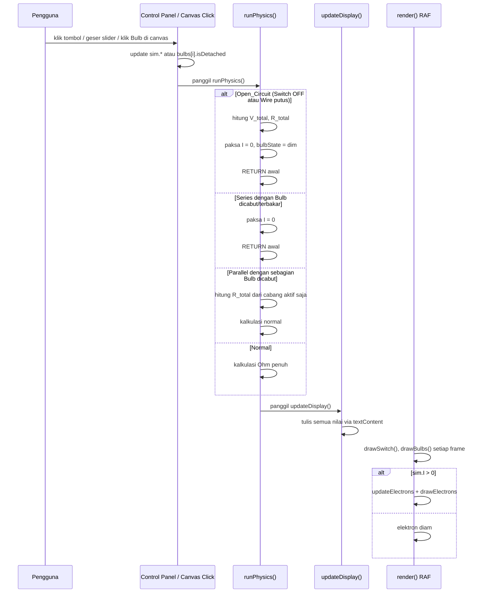

# Design Document — Simulator Sirkuit Digital

## Overview

Simulator Sirkuit Digital adalah aplikasi web edukasi single-page yang berjalan sepenuhnya di sisi klien. Arsitektur terdiri dari tiga lapisan yang saling terpisah namun terhubung melalui satu objek state terpusat (`sim`):

1. **Physics Engine** — menghitung nilai listrik berdasarkan Hukum Ohm dan Hukum Daya, dengan mempertimbangkan status Switch, Wire, dan kondisi setiap Bulb
2. **Canvas Renderer + Particle System** — menggambar semua visual di `<canvas>` HTML5, termasuk Switch_Visual, Bulb yang dicabut, dan Hit_Detection
3. **Control Panel + UI** — menerima input pengguna dan menampilkan hasil perhitungan menggunakan `textContent` untuk mencegah Layout Thrashing

Seluruh kode berjalan dalam satu IIFE di `js/sirkuit.js` tanpa dependensi eksternal.

---

## Aturan Utama Mutlak (Wajib Dipatuhi Tanpa Pengecualian)

1. **Zero-Comment Policy:** SELURUH file kode sumber DILARANG KERAS memuat komentar dalam bentuk apapun — termasuk `//`, `/* */`, dan komentar HTML `<!-- -->`. Wajib menerapkan Self-Documenting Code secara mutlak.

2. **Zero-Emoji Policy:** DILARANG KERAS menyisipkan karakter emoji, emoticon, atau simbol Unicode non-alfanumerik grafis di seluruh file kode sumber. Larangan berlaku mutlak untuk teks string HTML, nilai teks Canvas `fillText()`, label UI, nama variabel, nama fungsi, ID elemen, dan log konsol.

3. **Monomorphic State Object:** Objek state `sim` WAJIB dikunci sejak deklarasi awal dengan seluruh properti yang dibutuhkan seumur hidup aplikasi. Dilarang keras menambah, menghapus, atau mengubah shape objek `sim` di runtime.

4. **No External Dependencies:** Dilarang menggunakan framework, library, CDN eksternal, atau NPM packages.

5. **RAF-Only Animation:** Dilarang menggunakan `setInterval()` atau `setTimeout()` untuk kalkulasi loop animasi fisika.

6. **No Inline Style Mutation:** Dilarang memodifikasi properti geometri layout DOM di dalam loop animasi.

7. **Canvas-Only Rendering:** Seluruh visualisasi sirkuit, partikel, dan animasi wajib digambar eksklusif menggunakan HTML5 Canvas 2D API.

8. **textContent Isolation:** Semua penulisan teks ke elemen DOM status wajib menggunakan `element.textContent` — dilarang menggunakan `innerHTML` untuk mencegah Layout Thrashing dan risiko XSS.

9. **Isolasi Berkas Pengujian:** Dilarang keras menghasilkan file HTML atau JavaScript tambahan untuk keperluan testing. Arsitektur proyek wajib terkunci pada 3 berkas utama: `index.html`, `css/style.css`, dan `js/sirkuit.js`.

10. **Batasan Hak Akses Terminal:** Agen AI dilarang keras mengeksekusi perintah terminal atau CLI dalam bentuk apapun.

---

## Architecture

### File Structure

```
simulator_sirkuit_digital/
├── index.html          ← Struktur HTML, DOM references, link ke CSS dan JS
├── css/
│   └── style.css       ← Semua styling: layout, komponen, responsivitas
└── js/
    └── sirkuit.js      ← Semua logika: physics, renderer, particle, event handlers
```

### Module Boundaries (dalam sirkuit.js)

```
sirkuit.js (IIFE)
│
├── CONSTANTS              ← Nilai tetap (V_BATTERY, OVERLOAD_FACTOR, dll.)
├── sim (State Object)     ← Satu-satunya sumber kebenaran (monomorphic)
├── bulbs[]                ← Array objek Bulb monomorphic (isDetached, isBurnt)
│
├── Physics Engine
│   └── runPhysics()       ← Baca sim.* dan bulbs[], tulis sim.*
│
├── Canvas Renderer
│   ├── getGeometry()      ← Hitung koordinat dari ukuran canvas saat ini
│   ├── drawBackground()
│   ├── drawWires()        ← Delegasi ke drawSwitch()
│   ├── drawSwitch()       ← Gambar Switch_Visual di sisi kiri jalur kabel
│   ├── drawBatteries()
│   ├── drawBulbs()        ← Iterasi bulbs[], delegasi ke drawNormalBulb / drawBrokenBulb / drawDetachedBulb
│   └── drawPhysicsLabels()
│
├── Hit Detection
│   └── onCanvasClick(e)   ← Konversi koordinat, hitung jarak Pythagoras, toggle isDetached
│
├── Particle System
│   ├── electrons[]        ← Array partikel elektron normal
│   ├── blasts[]           ← Array partikel ledakan overload
│   ├── initElectrons() / updateElectrons() / drawElectrons()
│   └── spawnBlast() / updateBlasts() / drawBlasts()
│
├── Animation Loop
│   └── loop() → render() → requestAnimationFrame(loop)
│
├── UI / Display
│   └── updateDisplay()    ← Tulis ke DOM via textContent
│
└── Event Handlers + init()
```

---

## Component Design

### 1. State Object (`sim`) — Monomorphic, 17 Properti

Objek `sim` adalah struktur monomorphic — semua key didefinisikan saat deklarasi dan tidak pernah ditambah/dihapus di runtime. Properti `isSakelarTertutup` dan `isKabelPutus` ditambahkan sebagai kontrol mutlak atas aliran arus.

```javascript
const sim = {
  circuitType        : 'seri',
  batteryCount       : 1,
  bulbCount          : 1,
  bulbWatt           : 10,
  V_total            : 0,
  R_total            : 0,
  I                  : 0,
  I_peak             : 0,
  P_actual           : 0,
  bulbState          : 'normal',
  dimAlpha           : 1.0,
  wasOverload        : false,
  blastTime          : 0,
  blastActive        : false,
  isSakelarTertutup  : true,
  isKabelPutus       : false,
  activeR_total      : 0,
};
```

**Aturan:**
- `isSakelarTertutup` dan `isKabelPutus` adalah satu-satunya sumber kebenaran untuk kondisi Open_Circuit
- Hanya `runPhysics()` yang boleh menulis ke `sim.I`, `sim.V_total`, `sim.R_total`, `sim.P_actual`, `sim.bulbState`, `sim.dimAlpha`, `sim.wasOverload`, `sim.blastActive`, `sim.blastTime`, `sim.I_peak`, `sim.activeR_total`
- `onReset()` wajib mengatur kembali semua field ke nilai default

### 2. Array Bulb (`bulbs[]`) — Monomorphic Per-Bulb State

Array `bulbs[]` berisi objek monomorphic yang merepresentasikan kondisi setiap Bulb secara individual. Array ini di-rebuild setiap kali `bulbCount` berubah, namun shape setiap objek selalu identik.

```javascript
const bulbTemplate = {
  isDetached : false,
  isBurnt    : false,
};
```

**Aturan:**
- `bulbs[]` selalu memiliki panjang sama dengan `sim.bulbCount`
- Saat `bulbCount` bertambah, Bulb baru ditambahkan dengan `isDetached = false` dan `isBurnt = false`
- Saat `bulbCount` berkurang, Bulb terakhir dihapus dari array
- `isDetached` dapat di-toggle oleh `onCanvasClick()` jika `isBurnt = false`
- `isBurnt` hanya dapat diubah oleh `runPhysics()` (set `true`) atau `onReset()` (set `false`)

### 3. Physics Engine — `runPhysics()`

**Alur kalkulasi dengan dukungan Switch, Wire, dan Bulb Detachment:**

```
R_bulb = V_BATTERY² / bulbWatt

IF isSakelarTertutup = false ATAU isKabelPutus = true:
  sim.V_total  = hitung V_total sesuai konfigurasi
  sim.R_total  = hitung R_total sesuai konfigurasi
  sim.I        = 0
  sim.P_actual = 0
  sim.bulbState = 'dim'
  sim.dimAlpha  = 0.25
  RETURN

IF circuitType = 'seri':
  IF ada Bulb dengan isDetached = true ATAU isBurnt = true:
    sim.I = 0, sim.P_actual = 0, sim.bulbState = 'dim'
    RETURN
  V_total    = batteryCount × V_BATTERY
  R_total    = bulbCount × R_bulb
  V_per_bulb = V_total / bulbCount

IF circuitType = 'paralel':
  activeBulbs = bulbs.filter(b => !b.isDetached && !b.isBurnt)
  IF activeBulbs.length = 0:
    sim.I = 0, sim.P_actual = 0, sim.bulbState = 'dim'
    RETURN
  V_total    = V_BATTERY
  R_total    = R_bulb / activeBulbs.length
  V_per_bulb = V_BATTERY

I        = V_total / R_total
P_actual = V_per_bulb² / R_bulb

Tentukan bulbState dan dimAlpha (logika existing tidak berubah)
Trigger blast jika transisi ke overload
```

**Postconditions Open_Circuit (Switch OFF atau Wire putus):**
- `sim.I = 0`, `sim.bulbState = 'dim'`, `sim.dimAlpha = 0.25`
- `sim.V_total` dan `sim.R_total` tetap dihitung
- `sim.blastActive` tidak berubah

### 4. Canvas Hit Detection — `onCanvasClick(e)`

Hit Detection menggunakan koordinat yang diskalakan dari `canvas.getBoundingClientRect()` dan perhitungan jarak Pythagoras untuk mendeteksi klik pada setiap Bulb.

```pascal
PROCEDURE onCanvasClick(e)
  rect    = canvas.getBoundingClientRect()
  scaleX  = canvas.width  / rect.width
  scaleY  = canvas.height / rect.height
  clickX  = (e.clientX - rect.left) * scaleX
  clickY  = (e.clientY - rect.top)  * scaleY

  geo     = getGeometry()
  hitRadius = geo.bulbRadius * 1.4

  FOR i = 0 TO bulbs.length - 1:
    bulbX = getBulbX(geo, i, bulbs.length)
    bulbY = geo.bulbY
    dx    = clickX - bulbX
    dy    = clickY - bulbY
    dist  = sqrt(dx * dx + dy * dy)

    IF dist <= hitRadius AND bulbs[i].isBurnt = false:
      bulbs[i].isDetached = !bulbs[i].isDetached
      runPhysics()
      updateDisplay()
      RETURN
  END FOR
END PROCEDURE
```

**Aturan:**
- `scaleX` dan `scaleY` wajib dihitung dari `getBoundingClientRect()` untuk akurasi DPI dan zoom
- `hitRadius` lebih besar dari radius visual Bulb untuk kemudahan sentuh di layar mobile
- Bulb dengan `isBurnt = true` tidak dapat di-toggle melalui klik
- Setelah toggle, `runPhysics()` dan `updateDisplay()` dipanggil segera

### 5. Canvas Renderer — `drawSwitch(geo)`

Switch_Visual digambar di sisi kiri jalur kabel, di tengah antara titik `top-left` dan `bottom-left`.

```pascal
PROCEDURE drawSwitch(geo)
  switchX    = geo.left
  switchMidY = (geo.top + geo.bottom) / 2
  halfLen    = min(cw, ch) * 0.06

  IF sim.isSakelarTertutup = true:
    ctx.strokeStyle = '#00AA00'
    ctx.lineWidth   = 6
    gambar garis penuh dari (switchX, switchMidY - halfLen) ke (switchX, switchMidY + halfLen)
  ELSE:
    ctx.strokeStyle = '#CC0000'
    ctx.lineWidth   = 6
    gambar dua segmen terpisah dengan celah 8px di tengah

  ctx.fillStyle    = '#90b4ce'
  ctx.font         = '11px sans-serif'
  ctx.textAlign    = 'right'
  ctx.textBaseline = 'middle'
  labelText = isSakelarTertutup ? 'ON' : 'OFF'
  ctx.fillText(labelText, switchX - 8, switchMidY)
END PROCEDURE
```

### 6. Canvas Renderer — `drawBulbs(geo)`

Iterasi `bulbs[]` dan delegasi ke fungsi draw yang sesuai berdasarkan kondisi setiap Bulb.

```pascal
PROCEDURE drawBulbs(geo)
  FOR i = 0 TO bulbs.length - 1:
    bulbX = getBulbX(geo, i, bulbs.length)
    bulbY = geo.bulbY

    IF bulbs[i].isDetached = true:
      drawDetachedBulb(bulbX, bulbY + DETACH_OFFSET, geo.bulbRadius)
    ELSE IF bulbs[i].isBurnt = true OR sim.bulbState = 'overload':
      drawBrokenBulb(bulbX, bulbY, geo.bulbRadius)
    ELSE:
      drawNormalBulb(bulbX, bulbY, geo.bulbRadius, sim.dimAlpha)
  END FOR
END PROCEDURE
```

`drawDetachedBulb(x, y, radius)` menggambar Bulb dengan `strokeStyle = '#555'`, `fillStyle = '#333'`, dan posisi `y + DETACH_OFFSET` (misalnya 20px ke bawah) untuk menunjukkan Bulb tidak terhubung ke jalur kabel.

### 7. UI Display — `updateDisplay()` dengan textContent Isolation

Semua penulisan teks ke elemen DOM status wajib menggunakan `element.textContent` untuk mencegah Layout Thrashing. Dilarang menggunakan `innerHTML` untuk teks status apapun.

```pascal
PROCEDURE updateDisplay()
  elVoltage.textContent    = sim.V_total.toFixed(2) + ' V'
  elResistance.textContent = sim.R_total.toFixed(2) + ' Ohm'
  elPower.textContent      = sim.P_actual.toFixed(2) + ' W'

  IF NOT sim.isSakelarTertutup OR sim.isKabelPutus:
    elLabelCurrent.textContent  = 'Arus (I)'
    elCurrent.textContent       = '0.000 A'
    elStatus.className          = 'info-value info-value--status status-open'
    elStatus.textContent        = 'Sirkuit Terbuka'
    elBatteryLife.textContent   = '-'
    RETURN

  IF sim.bulbState = 'dim':
    elStatus.className   = 'info-value info-value--status status-dim'
    elStatus.textContent = 'Redup'
  ELSE IF sim.bulbState = 'normal':
    elStatus.className   = 'info-value info-value--status status-normal'
    elStatus.textContent = 'Menyala Normal'
  ELSE IF sim.bulbState = 'overload':
    elStatus.className   = 'info-value info-value--status status-overload'
    elStatus.textContent = 'Lampu Putus'

  [... logika tampilan arus, I_peak, battery life existing ...]
END PROCEDURE
```

**Aturan textContent Isolation:**
- Setiap penulisan teks status wajib menggunakan `element.textContent = '...'`
- Dilarang menggunakan `element.innerHTML = '...'` untuk teks status
- Dilarang menggunakan template literal yang mengandung tag HTML untuk teks status
- Penulisan `className` boleh menggunakan assignment langsung karena tidak menyentuh layout

### 8. Event Handler — `onSakelarToggle()`

```pascal
PROCEDURE onSakelarToggle()
  sim.isSakelarTertutup = NOT sim.isSakelarTertutup

  IF sim.isSakelarTertutup:
    btnSakelar.textContent = 'ON (Tertutup)'
    btnSakelar.classList.remove('btn-sakelar--off')
    btnSakelar.classList.add('btn-sakelar--on')
  ELSE:
    btnSakelar.textContent = 'OFF (Terbuka)'
    btnSakelar.classList.remove('btn-sakelar--on')
    btnSakelar.classList.add('btn-sakelar--off')

  btnSakelar.setAttribute('aria-pressed', sim.isSakelarTertutup ? 'true' : 'false')
  runPhysics()
  updateDisplay()
END PROCEDURE
```

### 9. Animation Loop

```javascript
function loop(timestamp) {
  render(timestamp);
  rafId = requestAnimationFrame(loop);
}
```

Loop berjalan terus-menerus via `requestAnimationFrame`. Tidak ada `setInterval` atau `setTimeout`. Renderer membaca `sim.*` dan `bulbs[]` secara read-only setiap frame.

### 10. Control Panel & Event Binding

| Kontrol | Element | Event | Handler |
|---|---|---|---|
| Jenis rangkaian | `input[name="circuitType"]` | `change` | `onCircuitTypeChange` |
| Jumlah baterai | `#batteryCount` (range) | `input` | `onBatterySlider` |
| Jumlah lampu | `#bulbCount` (range) | `input` | `onBulbSlider` |
| Watt nominal | `input[name="bulbWatt"]` | `change` | `onBulbWattChange` |
| Sakelar | `#btnSakelar` | `click` | `onSakelarToggle` |
| Reset | `#btnReset` | `click` | `onReset` |
| Klik canvas | `#circuitCanvas` | `click` | `onCanvasClick` |
| Resize window | `window` | `resize` | `onResize` |

Setiap handler: update `sim.*` atau `bulbs[]` → `runPhysics()` → `updateDisplay()`. Canvas diperbarui otomatis oleh loop RAF pada frame berikutnya.

---

## Data Models

### SimState (Objek `sim`) — 17 Properti

```typescript
interface SimState {
  circuitType        : 'seri' | 'paralel';
  batteryCount       : 1 | 2 | 3 | 4;
  bulbCount          : 1 | 2 | 3 | 4;
  bulbWatt           : 5 | 10 | 25;
  V_total            : number;
  R_total            : number;
  I                  : number;
  I_peak             : number;
  P_actual           : number;
  bulbState          : 'dim' | 'normal' | 'overload';
  dimAlpha           : number;
  wasOverload        : boolean;
  blastTime          : number;
  blastActive        : boolean;
  isSakelarTertutup  : boolean;
  isKabelPutus       : boolean;
  activeR_total      : number;
}
```

**Nilai default setelah reset:**

| Field | Default |
|---|---|
| `circuitType` | `'seri'` |
| `batteryCount` | `1` |
| `bulbCount` | `1` |
| `bulbWatt` | `10` |
| `V_total` | `0` |
| `R_total` | `0` |
| `I` | `0` |
| `I_peak` | `0` |
| `P_actual` | `0` |
| `bulbState` | `'normal'` |
| `dimAlpha` | `1.0` |
| `wasOverload` | `false` |
| `blastTime` | `0` |
| `blastActive` | `false` |
| `isSakelarTertutup` | `true` |
| `isKabelPutus` | `false` |
| `activeR_total` | `0` |

### BulbState (Objek dalam `bulbs[]`)

```typescript
interface BulbState {
  isDetached : boolean;
  isBurnt    : boolean;
}
```

Array `bulbs[]` selalu memiliki panjang sama dengan `sim.bulbCount`. Setiap objek diinisialisasi dengan `{ isDetached: false, isBurnt: false }`.

### ElectronParticle

```typescript
interface ElectronParticle {
  progress : number;
  size     : number;
  r        : number;
  g        : number;
  b        : number;
}
```

### BlastParticle

```typescript
interface BlastParticle {
  x     : number;
  y     : number;
  vx    : number;
  vy    : number;
  size  : number;
  life  : number;
  decay : number;
  hue   : number;
}
```

### GeometryResult

```typescript
interface GeometryResult {
  cx         : number;
  cy         : number;
  left       : number;
  right      : number;
  top        : number;
  bottom     : number;
  wirePath   : Array<{x: number, y: number}>;
  densePath  : Array<{x: number, y: number}>;
  batteryY   : number;
  bulbY      : number;
  bulbRadius : number;
}
```

### DOM Element References

| Variabel | Selector | Tipe |
|---|---|---|
| `canvas` | `#circuitCanvas` | `HTMLCanvasElement` |
| `ctx` | — | `CanvasRenderingContext2D` |
| `overloadBanner` | `#overloadBanner` | `HTMLDivElement` |
| `elVoltage` | `#displayVoltage` | `HTMLSpanElement` |
| `elResistance` | `#displayResistance` | `HTMLSpanElement` |
| `elCurrent` | `#displayCurrent` | `HTMLSpanElement` |
| `elPower` | `#displayPower` | `HTMLSpanElement` |
| `elStatus` | `#displayStatus` | `HTMLSpanElement` |
| `elLabelCurrent` | `#labelCurrent` | `HTMLElement` |
| `elCurrentPerBulb` | `#displayCurrentPerBulb` | `HTMLSpanElement` |
| `elItemCurrentPerBulb` | `#itemCurrentPerBulb` | `HTMLElement` |
| `elBatteryLife` | `#displayBatteryLife` | `HTMLSpanElement` |
| `elCurrentPeak` | `#displayCurrentPeak` | `HTMLSpanElement` |
| `elItemCurrentPeak` | `#itemCurrentPeak` | `HTMLElement` |
| `sliderBattery` | `#batteryCount` | `HTMLInputElement` |
| `labelBattery` | `#batteryCountDisplay` | `HTMLElement` |
| `sliderBulb` | `#bulbCount` | `HTMLInputElement` |
| `labelBulb` | `#bulbCountDisplay` | `HTMLElement` |
| `radiosCircuitType` | `input[name="circuitType"]` | `NodeList` |
| `radiosBulbWatt` | `input[name="bulbWatt"]` | `NodeList` |
| `btnReset` | `#btnReset` | `HTMLButtonElement` |
| `btnSakelar` | `#btnSakelar` | `HTMLButtonElement` |

---

## Main Algorithm/Workflow



---

## CSS Layout Architecture

### Responsive Grid

```
Mobile (< 640px):
  grid-template-columns: 1fr
  Urutan: canvas → info → controls (vertikal)

Tablet/Desktop (>= 640px):
  grid-template-columns: 1fr 320px
  grid-template-areas:
    "canvas  controls"
    "info    controls"

Large (>= 960px):
  grid-template-columns: 1fr 360px
```

### Touch Target Sizing

- Slider thumb: 32×32px, padding vertikal 17px → total touch area >= 44px
- Radio label: `min-height: 44px`, padding horizontal
- Reset button: `min-height: 48px`
- Switch button: `min-height: 48px`

### Visual States (CSS Classes)

```
.info-value--status.status-dim      → warna biru muda (#4fc3f7)
.info-value--status.status-normal   → warna hijau (#69f0ae)
.info-value--status.status-overload → warna merah (#ff5252)
.info-value--status.status-open     → warna abu-abu (#90b4ce)

.btn-sakelar--on  → background hijau gelap, border #00AA00
.btn-sakelar--off → background merah gelap, border #CC0000
```

---

## Data Flow Diagram

```
User Input (Control Panel / Canvas Click)
        │
        ▼
  sim.* atau bulbs[i].isDetached diperbarui
        │
        ▼
  runPhysics()
  ├── Cek Open_Circuit (Switch OFF / Wire putus) → early return
  ├── Cek Series dengan Bulb dicabut → early return I=0
  ├── Hitung R_total dari cabang aktif (paralel)
  ├── Hitung V_total, I, P_actual
  ├── Tentukan bulbState + dimAlpha
  └── Trigger blast jika transisi ke overload
        │
        ├──► updateDisplay()  ← tulis ke DOM via textContent
        │
        └──► sim.* dan bulbs[] siap dibaca oleh renderer
                    │
                    ▼
          requestAnimationFrame loop
          ├── getGeometry()
          ├── drawBackground / Wires / Switch / Batteries / Bulbs
          ├── drawElectrons (jika I > 0)
          └── drawBlasts (jika blastActive)
```

---

## Visual Design Decisions

### Colour Palette

| Token | Hex | Penggunaan |
|---|---|---|
| `--clr-bg` | `#0d1b2a` | Background utama (dark navy) |
| `--clr-surface` | `#1b2d45` | Card/panel background |
| `--clr-accent` | `#f7c948` | Kuning — highlight, baterai, nilai fisika |
| `--clr-accent-2` | `#4fc3f7` | Biru muda — elektron, kabel aktif |
| `--clr-success` | `#69f0ae` | Hijau — status normal, sakelar ON |
| `--clr-danger` | `#ff5252` | Merah — overload, lampu pecah, sakelar OFF |

### Bulb Visual States

| State | Visual |
|---|---|
| `dim` | Lingkaran kuning, `globalAlpha = dimAlpha` (0.25–<1.0), glow redup |
| `normal` | Lingkaran kuning penuh, `globalAlpha = 1.0`, glow terang |
| `overload/burnt` | Lingkaran merah gelap, garis silang merah, 3 titik percikan |
| `detached` | Lingkaran abu-abu, posisi turun `DETACH_OFFSET` px, tanpa glow |

### Switch Visual States

| State | Visual |
|---|---|
| ON (tertutup) | Garis penuh hijau `#00AA00`, label `'ON'` di kiri |
| OFF (terbuka) | Dua segmen merah `#CC0000` dengan celah 8px, label `'OFF'` di kiri |

---

## Error Handling

### E1 — Canvas Context Tidak Tersedia

Guard di `init()`:
```javascript
if (!ctx) {
  canvas.parentElement.textContent = 'Browser Anda tidak mendukung Canvas HTML5.';
  return;
}
```

### E2 — `drawBrokenBulb` Gagal Render

Try-catch di `drawBulbs()` dengan fallback kotak merah sederhana.

### E3 — `#btnSakelar` Tidak Ditemukan di DOM

Guard di `init()` sebelum event binding:
```javascript
if (!btnSakelar) throw new Error('btnSakelar element not found');
```

### E4 — Hit Detection di Luar Batas Canvas

`onCanvasClick()` menggunakan `getBoundingClientRect()` — jika klik di luar area canvas, koordinat yang dihasilkan akan berada di luar rentang `[0, canvas.width]` × `[0, canvas.height]` sehingga tidak ada Bulb yang terdeteksi dan tidak ada aksi yang diambil.

### E5 — Division by Zero di Physics Engine

Guard sudah ada: `R_total > 0 ? V_total / R_total : 0`. Untuk paralel dengan semua Bulb dicabut, `activeBulbs.length = 0` ditangani dengan early return sebelum kalkulasi R_total.

---

## Testing Strategy

### Property-Based Tests (Physics Engine)

Diimplementasikan sebagai fungsi `runSelfTests()` di dalam `js/sirkuit.js`:

- `assertSakelarForcesZeroCurrent()` — 96 kombinasi, verifikasi I = 0 saat Switch OFF
- `assertSakelarDimState()` — 96 kombinasi, verifikasi bulbState = 'dim' saat Switch OFF
- `assertSeriesDetachedForcesZeroCurrent()` — verifikasi I = 0 saat ada Bulb dicabut di seri
- `assertParallelDetachedReducesR()` — verifikasi R_total berkurang saat Bulb dicabut di paralel
- `assertOhmLaw()`, `assertPowerLaw()`, `assertBulbStateExclusive()`, `assertOverloadBreaksCurrent()`, `assertDimAlphaRange()`, `assertRbulbPositive()` — existing tests

### Unit Tests (Skenario Kritis)

| Skenario | Input | Expected |
|---|---|---|
| Switch OFF, seri 4b 1l 5W | isSakelarTertutup=false | I=0, bulbState=dim, blastActive tidak berubah |
| Wire putus, paralel 2b 2l 10W | isKabelPutus=true | I=0, bulbState=dim |
| Seri 2l, cabut 1 Bulb | bulbs[0].isDetached=true | I=0 |
| Paralel 3l, cabut 1 Bulb | bulbs[0].isDetached=true | I>0, R_total dari 2 cabang |
| Paralel 2l, cabut semua | bulbs[0,1].isDetached=true | I=0 |
| Reset saat Switch OFF | onReset() | isSakelarTertutup=true, isKabelPutus=false, semua isDetached=false |

---

## Requirements Traceability

| Requirement | Komponen yang Mengimplementasikan |
|---|---|
| R1: Struktur 3 file, client-side | `index.html`, `css/style.css`, `js/sirkuit.js` |
| R2: Physics Engine (Ohm, Daya, seri/paralel) | `runPhysics()` |
| R3: Switch ON/OFF, Open/Closed Circuit | `sim.isSakelarTertutup`, `onSakelarToggle()`, `drawSwitch()` |
| R4: Hit Detection, Bulb Detachment | `onCanvasClick()`, `bulbs[]`, `drawDetachedBulb()` |
| R5: Seri — Bulb dicabut memutus sirkuit | `runPhysics()` blok seri dengan isDetached check |
| R6: Paralel — Bulb dicabut hanya mematikan cabang | `runPhysics()` blok paralel dengan activeBulbs filter |
| R7: Wire continuity, isKabelPutus | `sim.isKabelPutus`, `runPhysics()` early return |
| R8: Canvas rendering, RAF loop, GPU accel | `render()`, `loop()`, CSS `will-change` |
| R9: Particle System elektron | `electrons[]`, `updateElectrons()`, `drawElectrons()` |
| R10: Visual Bulb 4 state (dim/normal/burnt/detached) | `drawNormalBulb()`, `drawBrokenBulb()`, `drawDetachedBulb()` |
| R11: Teks status ramah anak via textContent | `updateDisplay()` dengan textContent isolation |
| R12: Control Panel (slider, radio, sakelar) | HTML inputs + event handlers |
| R13: Display fisika real-time | `updateDisplay()`, `#overloadBanner` |
| R14: Responsivitas mobile, touch target | CSS Grid, media queries, `min-height: 44px` |

---

## Correctness Properties

Properti-properti ini adalah invariant yang harus selalu terpenuhi. Dapat diverifikasi dengan property-based testing di dalam `runSelfTests()`.

### Property 1: Hukum Ohm — Konsistensi I = V / R

**Validates: Requirements 2.1**

```
UNTUK SEMUA state dengan R_total > 0 dan bulbState != 'overload'
  dan isSakelarTertutup = true dan isKabelPutus = false:
  |sim.I - (sim.V_total / sim.R_total)| < 0.0001
```

### Property 2: Hukum Daya — Konsistensi P_actual = V_per_bulb² / R_bulb

**Validates: Requirements 2.2**

```
UNTUK SEMUA state dengan R_bulb > 0:
  P_actual = (V_per_bulb)² / R_bulb
  di mana V_per_bulb = V_total / bulbCount (seri)
                     = V_BATTERY (paralel)
```

### Property 3: Klasifikasi State Bulb Eksklusif dan Lengkap

**Validates: Requirements 2.5, 2.6, 2.7, 2.8**

```
UNTUK SEMUA nilai P_actual yang valid:
  tepat satu dari {dim, normal, overload} aktif

  dim      iff P_actual < P_nominal
  normal   iff P_nominal <= P_actual <= P_nominal * 1.3
  overload iff P_actual > P_nominal * 1.3
```

### Property 4: Overload Memutus Arus

**Validates: Requirements 2.8**

```
UNTUK SEMUA state dengan bulbState = 'overload':
  sim.I = 0
```

### Property 5: Rangkaian Seri — Tegangan Proporsional Baterai

**Validates: Requirements 2.3**

```
UNTUK SEMUA state dengan circuitType = 'seri' dan tidak ada Bulb dicabut/terbakar:
  sim.V_total = sim.batteryCount * V_BATTERY
  sim.R_total = sim.bulbCount * R_bulb
```

### Property 6: Rangkaian Paralel — Tegangan Konstan

**Validates: Requirements 2.4**

```
UNTUK SEMUA state dengan circuitType = 'paralel':
  sim.V_total = V_BATTERY   (tidak bergantung batteryCount)
  sim.R_total = R_bulb / activeBulbs.length
```

### Property 7: dimAlpha Proporsional dan Terbatas

**Validates: Requirements 10.2**

```
UNTUK SEMUA state dengan bulbState = 'dim' dan P_actual > 0:
  0.25 <= sim.dimAlpha < 1.0
  sim.dimAlpha = max(0.25, P_actual / P_nominal)

UNTUK SEMUA state dengan bulbState = 'dim' dan P_actual = 0:
  sim.dimAlpha = 0.25
```

### Property 8: Kecepatan Elektron Proporsional Arus

**Validates: Requirements 9.2, 9.3**

```
UNTUK SEMUA frame dengan sim.I > 0:
  speedFactor = min(sim.I * 8, 6)
  speedFactor > 0   (partikel tidak boleh diam)

UNTUK SEMUA frame dengan sim.I = 0:
  partikel elektron tidak bergerak (progress tidak berubah)
```

### Property 9: Blast Hanya Terpicu Satu Kali per Transisi Overload

**Validates: Requirements 9.5**

```
UNTUK SEMUA urutan state [s1, s2]:
  s1.bulbState != 'overload' DAN s2.bulbState = 'overload'
  → spawnBlast() dipanggil tepat satu kali

  s1.bulbState = 'overload' DAN s2.bulbState = 'overload'
  → spawnBlast() TIDAK dipanggil
```

### Property 10: R_bulb Selalu Positif

**Validates: Requirements 2.9**

```
UNTUK SEMUA nilai bulbWatt IN {5, 10, 25}:
  R_bulb = V_BATTERY² / bulbWatt > 0
```

### Property 11: Switch OFF Memaksa I = 0 untuk Semua Konfigurasi

**Validates: Requirements 3.2**

```
UNTUK SEMUA circuitType IN {'seri', 'paralel'},
UNTUK SEMUA batteryCount IN {1, 2, 3, 4},
UNTUK SEMUA bulbCount IN {1, 2, 3, 4},
UNTUK SEMUA bulbWatt IN {5, 10, 25}:
  JIKA isSakelarTertutup = false
  MAKA sim.I = 0 DAN sim.blastActive tidak berubah menjadi true
```

### Property 12: Seri — Satu Bulb Dicabut Memutus Seluruh Sirkuit

**Validates: Requirements 5.1**

```
JIKA circuitType = 'seri' DAN ada minimal satu Bulb dengan isDetached = true:
  sim.I = 0
```

### Property 13: Paralel — Bulb Dicabut Hanya Mematikan Cabang Tersebut

**Validates: Requirements 6.1**

```
JIKA circuitType = 'paralel' DAN ada Bulb dengan isDetached = true
  DAN ada Bulb lain dengan isDetached = false:
  sim.I > 0
  sim.R_total = R_bulb / activeBulbs.length
```

---

## Responsive Breakpoint Tests

| Breakpoint | Lebar | Orientasi | Expected Layout |
|---|---|---|---|
| Mobile kecil | 320px | Portrait | 1 kolom, canvas di atas |
| Mobile standar | 375px | Portrait | 1 kolom, canvas di atas |
| Mobile landscape | 640px | Landscape | 2 kolom (canvas+info / controls) |
| Tablet | 768px | Portrait | 2 kolom (canvas+info / controls) |
| Desktop | 1024px | Landscape | 2 kolom lebar |

---

## Components and Interfaces

### Component: PhysicsEngine

**Fungsi publik:**

```javascript
runPhysics() → void
```

**Antarmuka dengan modul lain:**
- Membaca `sim.*` dan `bulbs[]`
- Menulis ke `sim.V_total`, `sim.R_total`, `sim.I`, `sim.P_actual`, `sim.bulbState`, `sim.dimAlpha`, `sim.wasOverload`, `sim.blastActive`, `sim.blastTime`, `sim.I_peak`, `sim.activeR_total`
- Dipanggil oleh setiap event handler Control Panel dan `onCanvasClick()`

---

### Component: CanvasRenderer

**Fungsi publik:**

```javascript
getGeometry() → GeometryResult
render(timestamp) → void
resizeCanvas() → void
drawSwitch(geo) → void
drawDetachedBulb(x, y, radius) → void
onCanvasClick(e) → void
```

**Antarmuka dengan modul lain:**
- Membaca `sim.*` dan `bulbs[]` (read-only)
- Membaca `electrons[]` dan `blasts[]`
- Dipanggil oleh Animation Loop setiap frame
- `onCanvasClick()` menulis ke `bulbs[i].isDetached` lalu memanggil `runPhysics()` dan `updateDisplay()`

---

### Component: ParticleSystem

**Fungsi publik:**

```javascript
initElectrons(densePath) → void
updateElectrons(densePath, speedFactor) → void
drawElectrons(densePath) → void
spawnBlast(x, y) → void
updateBlasts() → void
drawBlasts() → void
```

**Antarmuka dengan modul lain:**
- Dipanggil oleh `render()` (Canvas Renderer)
- `spawnBlast()` dipanggil oleh `runPhysics()` saat transisi ke Overload_State
- Membaca `sim.I` dan `sim.blastActive` untuk kondisi eksekusi

---

### Component: AnimationLoop

**Fungsi publik:**

```javascript
loop(timestamp) → void
```

**Antarmuka dengan modul lain:**
- Memanggil `render()` setiap frame
- Tidak berinteraksi langsung dengan Physics Engine atau UI

---

### Component: ControlPanel (Event Handlers)

**Fungsi publik:**

```javascript
onCircuitTypeChange(e) → void
onBatterySlider(e)     → void
onBulbSlider(e)        → void
onBulbWattChange(e)    → void
onSakelarToggle()      → void
onReset()              → void
onResize()             → void
onCanvasClick(e)       → void
```

**Pola umum setiap handler:**
```
update sim.* atau bulbs[] → runPhysics() → updateDisplay()
```

---

### Component: UIDisplay

**Fungsi publik:**

```javascript
updateDisplay() → void
```

**Antarmuka dengan modul lain:**
- Membaca `sim.*` (read-only)
- Menulis ke DOM menggunakan `element.textContent` dan `element.className` (di luar loop RAF)
- Dilarang menggunakan `element.innerHTML` untuk teks status apapun
